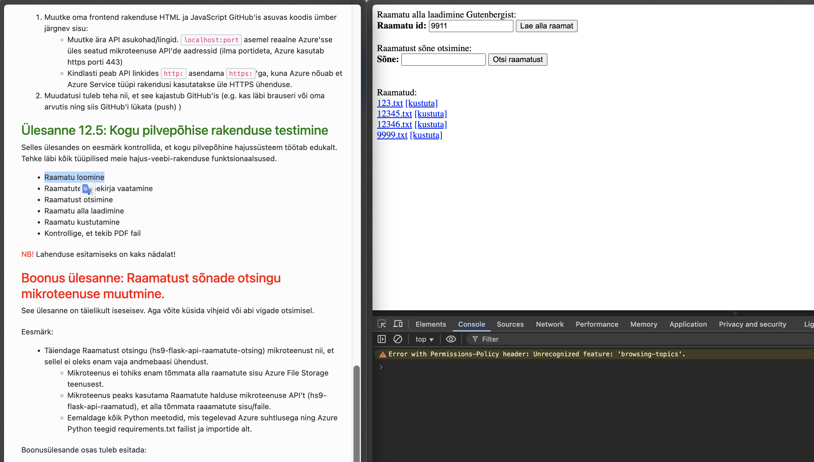
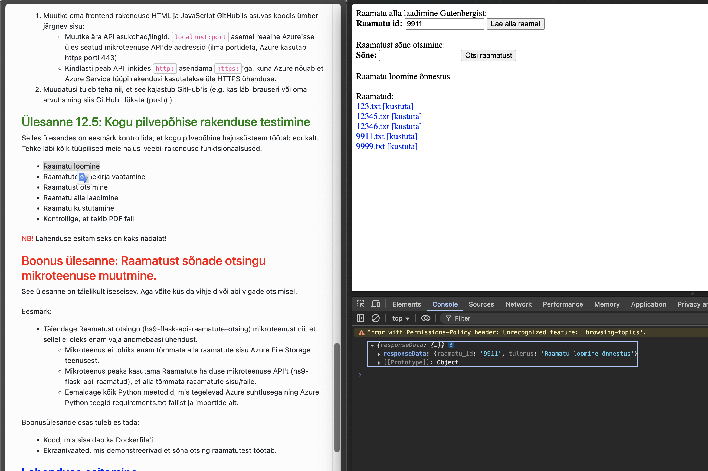
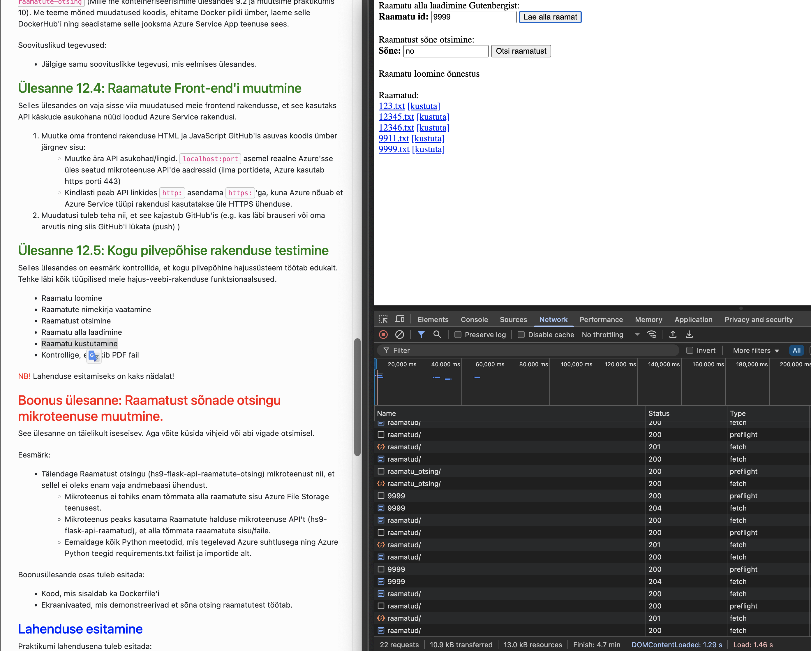
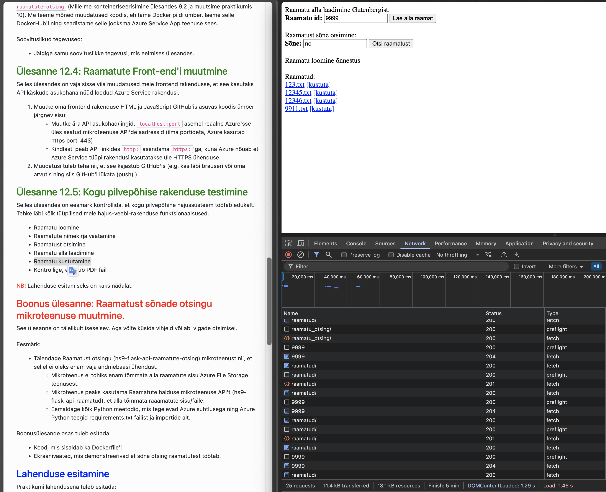
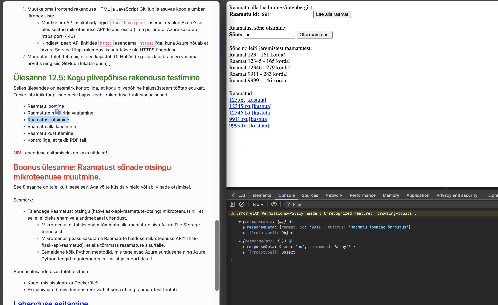
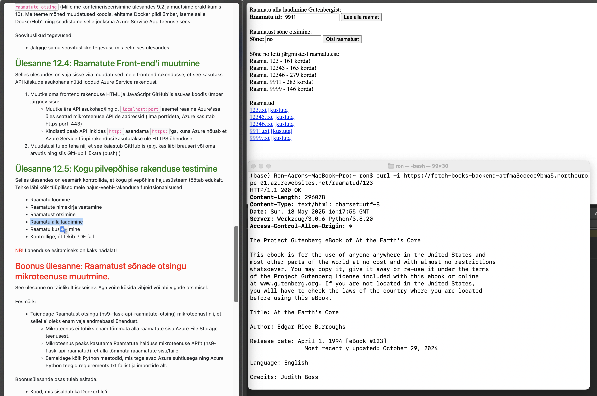
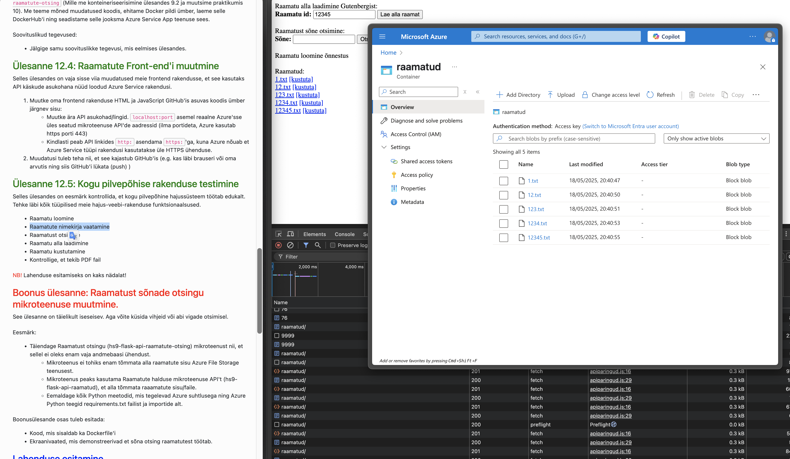
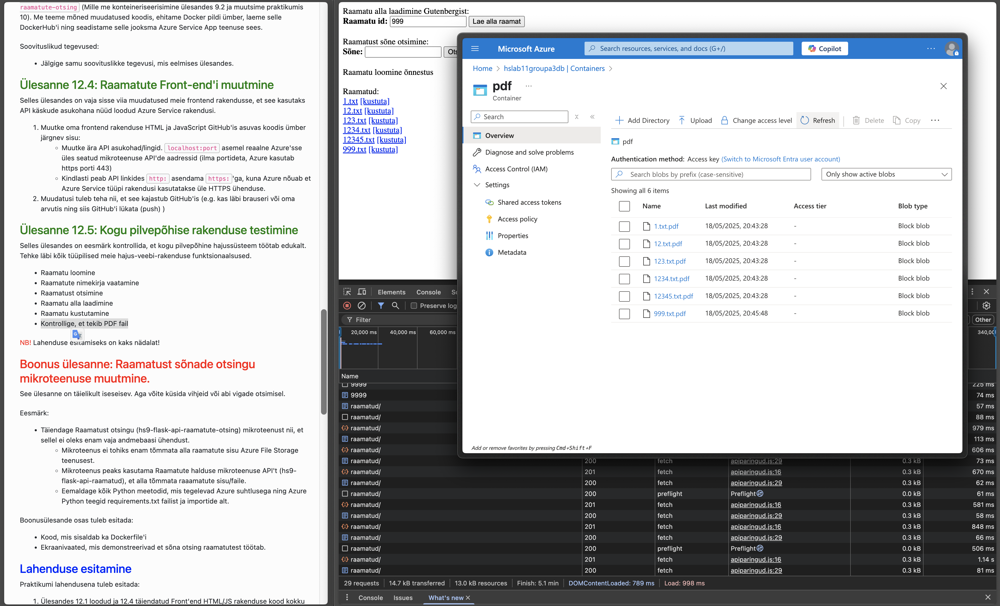

# Fetch-a-Book App

A simple three-service system for downloading, storing and searching Gutenberg books.

1. **Books API** (`hs12-flask-api-raamatud`)  
   - Exposes CRUD over Azure Blob Storage   
   - Endpoints:  
     - `GET  /raamatud/`  
     - `GET  /raamatud/{id}`  
     - `POST /raamatud/`  
     - `DELETE /raamatud/{id}`  

2. **Search API** (`hs12-flask-api-raamatute-otsing`)  
   - Searches one book or all books for a given word  
   - Endpoints:  
     - `POST /raamatu_otsing/`  
     - `POST /raamatu_otsing/{id}`  (unused in the application)

3. **Front-end** (`hs12-frontend`)  
   - Static HTML+JS served by Nginx, calls the above APIs  
   - Live list of books, download & delete links, and in-page search  

## *Live at – https://blue-sand-03a05a003.6.azurestaticapps.net/*


---

## Repository Structure

```
fetch-a-book-app/
├── hs12-flask-api-raamatud/          ← Books API service
│   ├── Dockerfile
│   ├── requirements.txt
│   └── hs12-flask-api-raamatud.py
├── hs12-flask-api-raamatute-otsing/  ← Search API service
│   ├── Dockerfile
│   ├── requirements.txt
│   └── hs12-flask-api-raamatute-otsing.py
├── hs12-frontend/                    ← Static UI
│   ├── Dockerfile
│   ├── frontend.html
│   └── apiparingud.js
├── docker-compose.yml                ← Local dev stack (optional)
└── .github/                          ← GitHub Actions for Azure Static Web Apps
```

---

## Live Azure Deployment

We host:

- **Books API** and **Search API** on **Azure App Service (Container)**  
- **Front-end** on **Azure Static Web Apps**  

### Environment Variables

For **both** App Service containers (`fetch-books-backend`, `fetch-books-search`):

| Name                  | Value                                                                                    |
| --------------------- |------------------------------------------------------------------------------------------|
| `AzureWebJobsStorage` | `<connection-string>` for your storage account configured to use container based storage |
| `blob_container_name` | `raamatud`                                                                               |

CORS is enabled in each Flask app (via `flask_cors`).

---

## Deployment Steps

### 1. Build & Push Docker Images

```bash
# Books API
docker build \
  -f hs12-flask-api-raamatud/Dockerfile \
  -t YOUR_DOCKERHUB_USER/hs12-flask-api-raamatud:latest \
  hs12-flask-api-raamatud

# Search API
docker build \
  -f hs12-flask-api-raamatute-otsing/Dockerfile \
  -t YOUR_DOCKERHUB_USER/hs12-flask-api-raamatute-otsing:latest \
  hs12-flask-api-raamatute-otsing

# Push
docker push YOUR_DOCKERHUB_USER/hs12-flask-api-raamatud:latest
docker push YOUR_DOCKERHUB_USER/hs12-flask-api-raamatute-otsing:latest
```

### 2. Configure Azure App Service

1. **Create** two Web Apps (Linux, Container), region North Europe, SKU F1.  
2. Under **Deployment Center → Container Registry**:  
   - Source: Docker Hub  
   - Image & tag: `YOUR_DOCKERHUB_USER/hs12-flask-api-raamatud:latest` (and similarly for search)  
   - Continuous deployment: ON  
3. Under **Configuration → Application settings**:  
   - Add `AzureWebJobsStorage` and `blob_container_name` (see above)  
4. **Restart** the Web Apps or hit Sync.

### 3. Deploy Front-end as Static Web App

1. In Azure: **+ Create → Static Web App**  
2. **Repository**: this GitHub repo, branch `main`  
3. **App location**: `/hs12-frontend`  
4. Leave **API** and **Output** locations empty  
5. After creation, edit `frontend.html` and `apiparingud.js` to point at your Azure hostnames:

   ```js
   const BOOKS_API  = "https://<fetch-books-backend>.azurewebsites.net";
   const SEARCH_API = "https://<fetch-books-search>.azurewebsites.net";
   ```

6. Commit & push—GitHub Actions will update your Static Web App.

---

## Verifying & Testing

### Using `curl`

```bash
# List
curl -i https://<BACKEND>/raamatud/

# Add (ID=123)
curl -i -X POST https://<BACKEND>/raamatud/ \
  -H "Content-Type: application/json" \
  -d '{"raamatu_id":"123"}'

# Download
curl -i https://<BACKEND>/raamatud/123

# Search for “and”
curl -i -X POST https://<SEARCH_API>/raamatu_otsing/ \
  -H "Content-Type: application/json" \
  -d '{"sone":"and"}'

# Delete
curl -i -X DELETE https://<BACKEND>/raamatud/123
```

### In-Browser

1. Visit your Static Web App URL.  
2. Use **“Lae alla raamat”** to fetch by Gutenberg ID.  
3. Click **download** or **[kustuta]** in the **Raamatud** list.  
4. Use **“Sõne”** search form.

---

## Troubleshooting

- **No PDF trigger?**  
  Ensure your blobs land in the **hslab11groupa3db/raamatud** container that your Function watches.  
- **500 on delete?**  
  Check the HTTP status (should be 204) and tail your App Service log stream.  
- **Docker not updating?**  
  Toggle Continuous Deployment OFF→ON or restart.  

---

## Further Work

- It is possible to integrate an Azure Function to convert txt books to PDF - implemented on the pictures, although not covered in this repository.
- Secure the APIs (Azure AD, API keys).

---

## Function testing in production

### Raamatu loomine
  


### Raamatu kustutamine
  


### Raamatust otsimine
  

### Raamatu alla laadimine
  

### Raamatute nimekirja vaatamine
  

### Kontroll et PDF fail tekib

